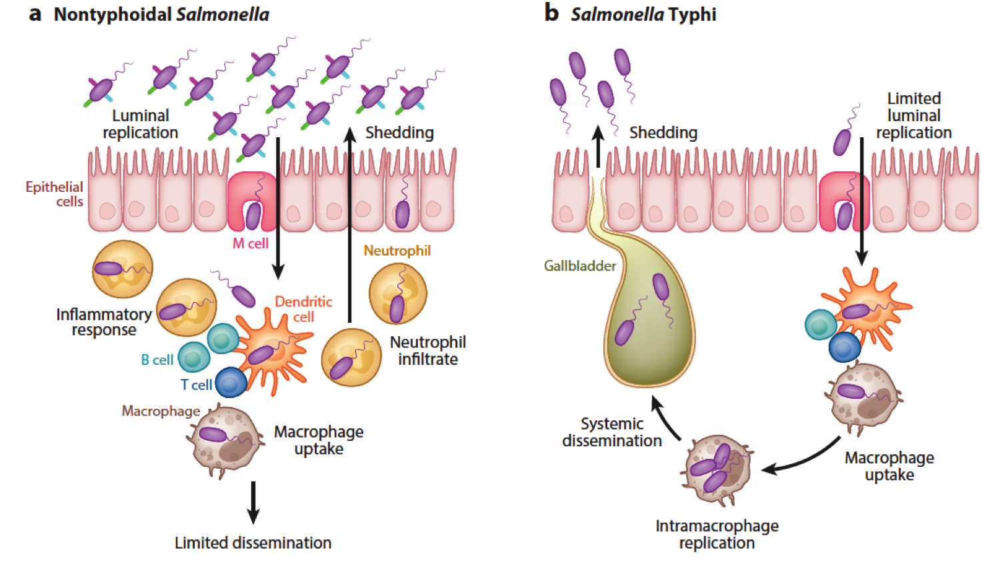

# Pathogenic *Salmonella*

Pathogenic *Salmonella* fall into two broad categories: typhoidal and non-typhoidal (NTS). 

The former, responsible for typhoid fever, include *Salmonella enterica* serovar
Typhi (*S.* Typhi) and *Salmonella enterica* serovar Paratyphi (*S.* Paratyphi).
Such pathogens are considered "host-restricted" since they target only humans and 
higher primates. The typhoidal strains cause severe blood borne infections and are 
more common in underdeveloped countries, where contaminated water often harbors 
the bacteria. Left untreated, typhoid fever can lead to shock, organ failure and death.

On the other hand,Non-typhoidal *Salmonella* (NTS) serovars such as
*Salmonella enterica* serovar Typhimurium (*S.* Typhimurium) are ubiquitous and
they  are the 
leading cause of bacterial food-borne illness, which typically involves 
gastrointestinal distress, nausea, vomiting and diarrhea.
Over 2,500 variant forms of NTS exist. Unlike typhoidal strains, NTS infect a wide
variety of animal hosts, including humans.
While no vaccine exists for NTS, associated illness is usually self-limiting in 
healthy people.

# Invasive salmonellosis in sub-Saharan Africa

A highly invasive form of NTS disease, frequently associated with *S.* Typhimurium 
isolates, has emerged as a major public health problem in sub-Saharan Africa. 
This disease is characterized by bacteraemia and/or meningitis, with septic arthritis
also reported. The clinical presentation is nonspecific, with fever often the only 
clinical sign and a history of gastroenteritis present in under half of all cases.
Many NTS *S.* Typhimurium isolates causing invasive disease are multiply antibiotic 
resistant, compromising the clinical treatment of the disease.

Multilocus sequence typing of more than 50 *Salmonella* isolates from blood or 
cerebrospinal fluid specimens from patients in Malawi and Kenya, found that many 
belong to a dominant sequence type, ST313.
These isolates are genetically distinct from well-characterized gastroenteritis-inducing 
ST19 strains, such as 14028s, SL1344 and LT2.
No animal reservoir has been identified so far for ST313 strains, and it has been
suggested that unlike other ‘classical’ foodborne NTS infections, which are often 
transmitted via zoonotic routes, ST313 strains may pass primarily through 
human-to-human contact.

Given the highly drug-resistant nature of ST313, effective treatment is challenging, 
particularly in resource-poor regions with inadequate health infrastructure.
Fatality rates for children range from 20-25 percent, while rates for HIV-positive 
patients may run as high as 50 percent.
There is urgent need to understand the pathogenic strategies used by these deadly 
invasive NTS strains to cause disease in order to facilitate the development of
novel diagnostic tools and for the design of effective treatments and prevention
strategies. 

# *S*. Typhimurium pathovar D23580

Sequencing of a representative ST313 isolate, D23580, revealed a large number of 
pseudogenes and deletions. As genomic degradation is a hallmark of host-adapted 
or restricted *Salmonella* serovars, like *S.* Typhi, in contrast to most strains of 
generalist serovars, like *S.* Typhimurium , the ST313 strain D23580 is considered
to be evolving to become more host-adapted to humans.
Thus, whereas categorized as NTS, Salmonella strain D23580 appears to lie somewhere 
in between the conventional designations of typhoidal and non-typhoidal *Salmonella*.

# *S*. Typhimurium pathovar D23580: genes, pseudogenes and prophages

In bacteria, host restriction and change of ecological niche (gut to systemic
disease) have been linked to the accumulation of large numbers of pseudogenes and 
an overall reduction in genome size. 
Whole-genome comparisons between D23580 and LT2, SL1344, and DT104 NCTC13348 revealed 
extensive synteny and colinearity. However, in addition to representing a distinct 
Multi Locus Sequence Type (MLST), the chromosome of D23580 had features that
differentiated it from S. Typhimurium strains LT2, DT104 NCTC13348, and SL1344.

- D23580 had undergone genome reduction similar to that of other
  human-restricted 
  serovars like *S.* Typhi (D23580 genome is 15 kb shorter than SL1344).
- D23580 was found to contain a novel prophage repertoire, as well as the presence 
  of a large insertion of Multi Drug Resistant genes on the large pSLT-BT plasmid. 
- A large number of the pseudogenes and deletions identified are consistent with
  what has been observed for *S.* Typhi:

    1) **Absence of *pipD* and *ratB* in the D23580 genome:** These genes are
    associated with diarrhea and colonization of the mammalian
    intestine by *S.* Typhimurium ST19 strains. The absence of diarrhea in some
    patients with invasive *S.* Typhimurium ST313 infections has been attributed
    to a reduced propensity of these strains to elicit host inflammatory responses
    which may result from the lack of *pipD* and *ratB*.

    2) **Point mutations in  *katE* and *bcsG* in the D23580 genome:** These
    genes encode stationary-phase catalase and a cellulose biosynthetic
    protein, respectively. Their absence comports loss of oxidative stress resistance 
    and the ability to form RDAR (red, dry, and rough) colonies that are required for 
    multicellular development. It is interesting that the human-adapted *S.* Typhi 
    also exhibits reduced catalase activity.

    3) **D23580 shows a distinct repertoire of five prophage-like elements,
    designated BTP1 through BTP5:** A region of ~40 kb,
    corresponding to the prophage ST64B, which is rudimentary
    in the chromosome of *S.* Typhimurium LT2, may have a potential role in iron
    uptake and growth ability in human blood.

    4) **S. Typhimurium. D23580 contained a total of 77
      assignable pseudogenes**, of which 23 were specific to this strain:

        - *sseI* (belonging to the SPI-2) is a pseudogene in D23580.
        - Two D23580-specific pseudogenes, STM_MW29741 and STM_MW10251, are predicted
          to encode regulators and may therefore affect expression of multiple genes. 
        - Eleven of the 23 pseudogenes that are specific for D23580 are also either pseudogenes
          or completely absent from *S.* Typhi or *S.* Paratyphi A. For example, the *ratB* gene 
          that encodes a secreted protein implicated in long-term persistence in the murine 
          intestine is inactivated by a frameshift mutation in *S.* Typhi and by a premature 
          stop codon in D23580.
        - Twelve D23580-specific pseudogenes that are apparently intact in *S.* Typhi and 
          *S.*Paratyphi A as well as *S.* Typhimurium SL1344, DT2, and LT2, include the
          *lpxO* gene that encodes a putative dioxygenase required for the synthesis
          of 2-hydroxymyristate modified lipid A.

    5) **D23580 genome presents large deletions:**
        - A deletion of 723bp results in loss of the 59 end of the *pipD* gene
          located in SPI-5. 
          The *pipD* gene is required by *S.* Typhimurium for induction of fluid
          secretion in bovine ileal loops.
        - A deletion of 3981 bp has removed some or all of STM1548 through STM1553,
          which are of unknown function. 
        - A 9568 bp deletion in a phage remnant resulted in the deletion of at
          least twelve putative coding sequences (CDSs), including *pagO* and
          *mig-13*. The *pagO* gene is regulated by the phoP/phoQ two-component
          regulator that also influences the expression of key virulence 
          genes encoded on SPI-1 and SPI-2. The *mig-13* gene encodes a putative
          membrane protein that was identified on the basis of up-regulation on
          invasion of cultured macrophages. 
          Both *mig-13* and *pagO* have been implicated in systemic persistence.
        - A 1694 bp deletion affects the *allP* and *allB* genes encoding allantoin 
          permease and allantoinase. Interestingly, *allP* and *allB* are also
          pseudogenes in *S.* Typhi.

    6)  The hypothetical virulence determinant (ST313-TD) is included within a 17.7 kb 
    region that may represent a novel pathogenicity island (ST313-GI).
    
    7) A region of ~40 kb, corresponding to the prophage ST64B in the genomes of
    virulent strains of S. Typhimurium, which is rudimentary in the chromosome of the 
    attenuated isolate LT2. a potential role of ST64B in iron uptake, as well as growth 
    ability, in human blood could be ruled out.

