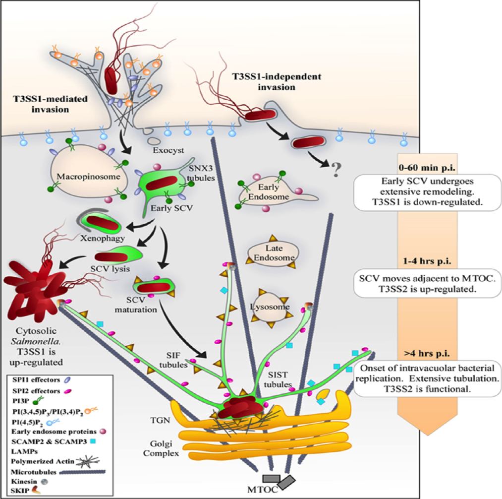

### Dendritic Cells characteristics
One of the most relevant antigen-presenting cells are dendritic cells (DCs), 
which are a link between innate and adaptive immunity. These cells have the capacity 
to directly recognize and uptake pathogens at the site of infection and migrate 
to the lymph nodes to activate bacteria-specific T cells. The DCs locate in 
peripheral tissues, where they are usually found in an immature state. 
In such a state, DCs have an elevated phagocytic capacity with reduced expression 
of co-stimulatory molecules, such as CD80, CD86 and CD40. After pathogen-associated 
molecular pattern (PAMP) detection, peripheral/immature DCs become activated and 
undergo functional and phenotypic changes known as maturation. This response is 
triggered on DCs by the signalling via specific receptors, such as Toll-like receptors, nucleotide oligomerization domain (NOD) proteins and NOD-like receptors (NLR). 
These receptors translate PAMP recognition into cellular responses, activating 
the secretion of anti-bacterial molecules and pro-inflammatory cytokines that 
enhance the bactericidal capacity of phagocytic cells. As the result of maturation, 
DCs decrease phagocytosis and increase the expression MHC-I, MHC-II and co-stimulatory molecules, which are surface molecules required for the activation of antigen-specific 
naive T cells. Maturing DCs also secrete cytokines that contribute to defining the 
nature and polarization of the effector function of T cells after recognition of 
peptide–MHC on the DC surface. Mature DCs acquire the capacity to migrate from 
peripheral sites of infection to the lymph nodes, where naive T cells reside. 
The establishment of a regulated and efficient adaptive immune response against 
the infecting bacteria requires DCs to prime naive T cells recognizing bacterial antigens. Consistent with this notion, the acquisition of molecular mechanisms by virulent
bacteria to interfere with DC function and prevent the activation of T cells could 
significantly contribute to the survival and dissemination of these pathogens
inside the host.

An important intracellular bacterial pathogen is *Salmonella enterica* serovar Typhimurium, which is a common cause of food poisoning and gastroenteritis in humans, 
as well as the aetiological agent for typhoid-like disease in mice.
Because DCs are fundamental for the initiation and establishment of an 
anti-bacterial adaptive immunity, the interference of their function can be a 
pathogenicity mechanism used by *S*. Typhimurium to prevent recognition by the 
host adaptive immunity. Several *S*. Typhimurium virulence proteins are thought 
to contribute to intracellular survival and systemic dissemination of this pathogen. 

When confronted with an intracellular pathogen, such as *Salmonella*, DC have 
to assume a dual role: 

1) They become themselves a target of infection by the pathogen
2) They must initiate and regulate the immune defence against this pathogen. 
These two roles are relevant to vaccine research and our understanding of 
*Salmonella*- related disease

### *Salmonella* subverts Dendtritic Cells response
__Host Adaptation__:

Infection of murine DCs with either *S* . Typhi or *S* . Enteritidis, 
two serovars adapted to different hosts, leads to an efficient T-cell activation
both *in vitro*  and *in vivo* . Accordingly, *S*.  Typhi and *S*.  Enteritidis 
failed to replicate within murine DCs and were quickly degraded, allowing T-cell 
activation. In contrast, human DCs were found to be permissive for survival and 
proliferation of *S* . Typhi, but not for *S* . Typhimurium or *S*.  Enteritidis. 
This suggests that *Salmonella*  host restriction is characterized by the ability 
of these bacteria to survive within DCs and avoid activation of the adaptive immune 
response in their specific hosts.

__DC ruffles__:

DCs infected with *S*. typhimurium present generalized ruffles on the surface of 
the plasma membrane appearing in the form of microplicae. 

__Invasion__:

1) Trigger: SPI1-T3SS effectors (SipA, SipC, SopB, SopD, SopE and SopE2) induce 
extensive rearrangements of both the plasma membrane and the underlying actin 
cytoskeleton, resulting in the formation of macropinosomes. Entrance mediated by 
SPI1-T3SS may lead to excessive bacterial load and cell death.

2) Zipper: through the protein Rck wich induce minor actin filament rearrangment.

3) Classical phagocytosis: due to recognition of bacterial PAMPS by DC receptors. 

The Rho GTPases, CDC42,and Rac1, are required for the initiation of actin  
polymerization during Fc gamma receptor-mediated phagocytosis as well as for 
*Salmonella* invasion. 

__Intracellular localization__:

The intracellular fate of *Salmonella* in DCs differs from that in macrophages. 
Compared with macrophages, where the pH 5.0 is reached shortly after phagocytosis, 
phagosome acidification in DCs is delayed. The maintenance of a slightly alkaline 
pH was shown to be important to prevent destruction of potential peptides for antigen presentation and recognition by T cells. The NADPH oxidase or NOX2 is in charge 
of producing oxygen radicals and controlling phagosomal pH. The absence of NOX2 
in DCs led to increased antigen degradation, resulting in impaired “cross-presentation” 
of phagocytosed antigens to CD8+ T cells and subsequently, decreased T cell activation.
Although both the SPI2-T3SS and PhoP/Q regulatory system are important for intracellular survival and replication in macrophages, both virulence factors are not essential 
for entry and survival of Salmonella in DCs. A further disparity between fates 
of *Salmonella* within macrophages and DCs is the intracellular proliferation. 
Inside murine macrophage cell line cells, replication initiates after an initial 
lag period of 3–4 h after internalization. The function of the SPI2-T3SS and its 
translocated effector proteins is required for intracellular replication. 
In contrast, in murine bone-marrow derived DCs, *Salmonella* is able to survive, 
but does not replicate. Although the SPI2-T3SS is not essential for *Salmonella*
survival in DCs, it does influence the maturation of the SCV. 
This indicates that Salmonella is able to modify normal cellular processes in DCs. 
Inside murine DCs the SCVs can locate at a specific sub-cellular area inside DCs, 
near to the trans-Golgi network. 
At 24 h postinfection the internalized bacteria were contained in either of two 
types of phagosomes: tight phagosomes or spacious phagosomes.
The spacious phagosomes were exclusively induced by the virulent strains, whereas the attenuated strains were contained in tight phagosome. Over time, the attenuated 
bacteria were degraded after internalization, as depicted by the loss of integrity 
of the bacteria profiles within the phagosomes.
The SCV biogenesis can be divided arbitrarily into three stages: 

- early (10 min–1 h postinfection), 
SNX3 associates to specific tubular structures (SNX3 tubules) that last from 30 min 
to 2 h after invasion and contribute to the recruitment of Rab7 and LAMP1 to the 
SCV and to the movement of the vacuole.

- intermediate (1 h–4 h), 
The intermediate stage in the SCV development is characterized by dynein-mediated 
movement of the vacuole along microtubules to reach a juxtanuclear position adjacent
to the microtubule-organizing center.

- late (>4h).
During the late stage of SCV maturation, a set of T3SS effectors, exhibiting both 
cooperative and antagonistic activities, are involved in the maintenance of the 
vacuole at its perinuclear position, as well as in the generation of different 
types of tubular networks, namely, Salmonella-induced filaments (SIFs), 
Salmonella-induced secretory carrier membrane protein 3 (SCAMP3) tubules (SISTs), 
and LAMP1-negative tubules (LNTs), that are more easily observed in cultured 
epithelial cells.

__Cytokine induction:__

TNF-a production by DCs may work in an autocrine or paracrine fashion during *Salmonella* infection to orchestrate DC maturation to link the innate and adaptive immune responses. 
IL-12 and IFN-g are also important for host survival of *Salmonella* infection, 
and the capacity of DCs to produce these cytokines during *Salmonella* infection 
has been examined.
Stimulation of DCs with *Salmonella* resulted in a rapid up-regulation of CCL5, 
CCL20, CXCL10, TNF-a, and IL-18 mRNA expression, starting at 3 h after infection. 

__Surface marker:__

Genes encoded on SPI-2 T3SS appear to suppress antigen presentation by DC, which 
limits a robust immune response by the infected cells.
CD80, CD86, or CD40 costimulatory molecules are up-regulated in DCs that come in
contact with *S*. typhimurium.
However, a hallmark of *S*. Typhimurium is its capacity to prevent the processing 
and presentation of bacterial antigens by DCs to T cells, both on class I and 
class II MHC molecules. Importantly, suppression of antigen presentation by *S*.
Typhimurium is restricted to antigens expressed by this bacterium, because DCs infected with *Salmonella* remain capable of presenting bystander soluble antigens.
It has also been described that *S*. Typhimurium infection reduces the amount of 
MHC molecules expressed on the surface of both mouse and human DCs. Studies in 
this area suggest that this evasion mechanism is the result of the negative effect 
of bacteria effector proteins in both endosomal trafficking and lysosomal degradation of the bacterium. This effect results in reduced availability of bacterial antigens 
loaded on MHC molecules and poor activation of T cells. Additionally, studies in 
human DCs suggest that *S*. Typhimurium infection promotes degradation of HLA-DR 
molecules by poly-ubiquitination.

__Receptors:__

Given the structure of bacteria, it follows that *Salmonella* expresses several 
PAMPs that can simultaneously be recognized by TLRs, including but certainly not 
limited to LPS, which is recognized by TLR4, as well as flagellin and CpG motifs 
in DNA, which are recognized by TLR5 and TLR9, respectively.

__Cell viability:__

Although, they do not provide hospitable environment for the survival of the pathogen, DCs act as steady carrier of *Salmonella* for its passive dissemination to systemic sites. 
Also *Salmonella* induces caspase-1 mediated cytotoxicity in DCs depending upon 
SPI1 needle assembly and the expression of SPI1 effector protein SipB.
The killing is possibly mediated by stimulation of P2X7 receptor or pore forming
property of SPI1 which leads to leakage of cytoplasmic.

