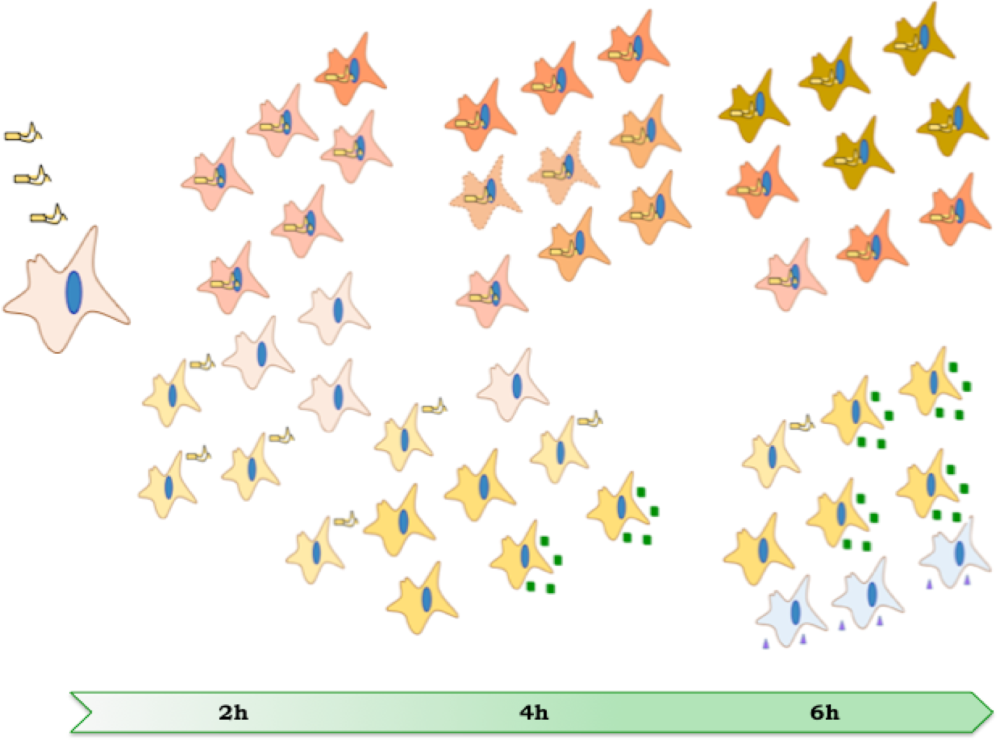

<!-- date field above copied from BiocStyle to dynamically update it.-->

Welcome !

# Introduction

This *R Markdown Website* presents a single-cell RNA-sequencing experiment
and analysis of dendritic cells following *Salmonella* infection.

# Background

*Salmonella* Typhimurium is generally responsible for localized self-limiting,
gastroenteritis in humans. However, the multi-drug resistant S. Typhimurium
ST313 pathovar has emerged across sub-Saharan Africa as a major cause of lethal
bacteremia in children and HIV-infected adults. The isolate D23580 is a
representative blood-stream clinical isolate from a Malawian child,
and demonstrates genome degradation resembling that of the human restricted
pathogen S. Typhi.

Dendritic cells (DCs) play an essential role in the initiation and
establishment of antigen-specific immune responses. Modulation of DC functions
by Salmonella has been reported as a mechanism to avoid adaptive immunity.
Studies aimed at elucidating the interaction between invasive Salmonella and
human DCs yielded important insights, yet they are limited by population-level
measurements that mask fundamental differences among individual cells.

# Method & Results

We combined single cell RNA-seq technology with fluorescent labelling of
bacteria to monitor gene expression variation among otherwise seemingly
identical cells with regard to the infection phenotype.
We quantified the early time course of gene expression induced by S.
Typhimurium LT2 or D23580 infection in 373 human monocyte-derived dendritic
cells.

# Conclusion

To our knowledge, this is the first single-cell study carried out in human DCs
to provide new insights into the molecular contest at the Salmonella-host
interface and suggest new areas of research to understand the mechanisms of
invasive Salmonella disease. 

# Graphical abstract



# Requirements

The following packages were require to perform the analysis and produce
those HTML pages from the count files:

```{r checkPkgs, child="_checkLibraries.Rmd"}
```

<!-- Create necessary directories -->

```{r dir.create, include=FALSE}
dir.create("rds", showWarnings = FALSE)
dir.create("HVGs", showWarnings = FALSE)
```
