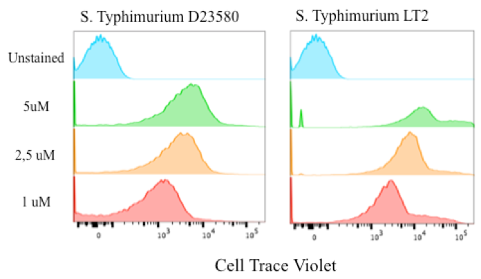
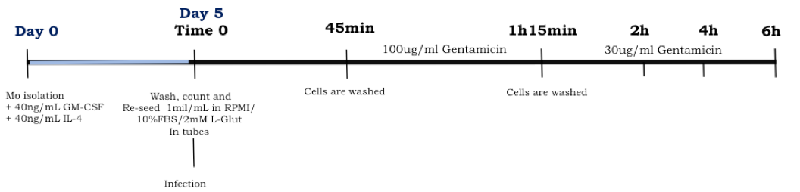
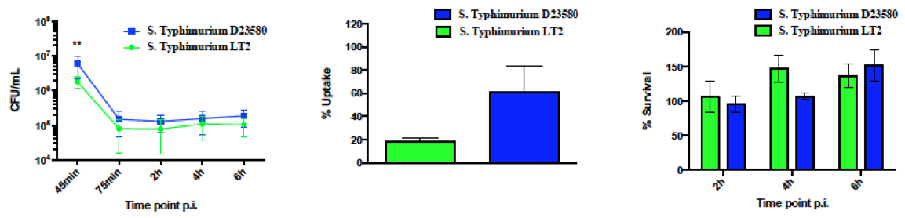
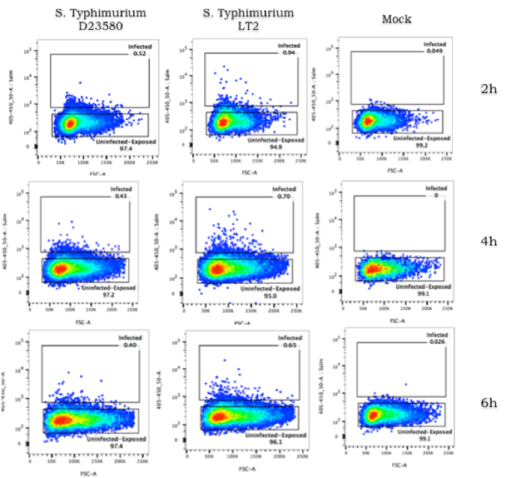

# Bacteria staining

S. Typhimurum LT2 and S. Typhimurium D23580 were grown in LB broth supplemented
with glucose at a final concentration of $10\%$. Bacteria were harvested during
the logarithmic growth phase and aliquots were kept frozen at –80°C until use.

For each experiment an aliquot of the each bacteria was thawed, diluted in RPMI
and incubated in presence of 5uM of Cell Trace Violet at 37°C for 20min in
gentle shaking. Bacteria were then washed and resuspended in RPMI to reach a
MOI of $10:1$ (bacteria : dendritic cells).

The number of microorganisms at each time point post infection was assessed by
plating 10-fold dilutions of the bacterial suspension, in quadruplicate, on LB
agar.

#	Infection model

Monocyte derived Dendritic Cells (MoDCs) were obtained by incubation of freshly
isolated human monocytes with 40ng/mL recombinant human (rh) Granulocyte
Macrophage-Colony-Stimulating Factor (GM-CSF) and 40ng/mL rhIL-4 (Peprotech).

After 5 days of culture, cells were harvested, washed and resuspended in
antibiotic-free RPMI supplemented with 2 mM L-glutamine and 10% heat-inactivated
FBS, and seeded in tubes at a density of 1x10^6^ cells/tube.

Infection is performed in tubes according to the protocol described in
*Jones et al., Advanced Methods and Protocol. Methods in Molecular Biology*.

Cells were infected with S. Typhimurium LT2 or S. Typhimurium D23580 at a
multiplicity of infection (MOI) of 10 bacteria per cell. Contact with the
dendritic cells (DCs) was maximized by 5 min centrifugation at 500g at room
temperature. Infected Cells were immediately incubated at 37°C in humidified
air containing 5% CO2.  The time zero of an experiment was set at the
beginning of this incubation. At 45min post infection cells were washed twice
with PBS to remove extracellular bacteria and fresh medium supplemented with
100ug/mL of Gentamicin was added. After a 30 min incubation (75min post
infection) at 37°C, 5% CO2, the gentamicin concentration was reduced to 30ug/mL
until the end of the assay.

# Sorting

At 2h, 4h or 6h post infection cells were harvested, washed, stained with
Propidium Iodide and acquired in the FACSaria III. Dead PI+ cells were gated
out.

Based on the Fluorescence intensity of the Cell Trace Violet dye, both S.
Typhimurium LT2 and S. Typhimurium D23580 challenged DCs were gated as exposed
(Cell Trace Violet -/PI-) or infected (Cell Trace Violet +/PI-).

Single cells were sorted in different wells of a 96well plate filled with 4uL
of lysis buffer (Triton 0.4%, 2U/uL RNase inhibitor, 7.5uM oligo dT, 10mM dNTP
[supplemented with ERCC spike-in $1:10,000,000$]).

Single sorted cells were immediately vortexed, spun down and frozen on dry ice
before being stored at -80C.

# Single cell RNA-seq and library preparation

Single-cell libraries were prepared as reported in the Smart-seq2 protocol by
[@Picelli_2014], with some technical adaptation: 

*	0.4% Triton and 7.5uM of oligodT have been used in the lysis buffer;
*	SuperScript II RT was used at a concentration of 0.25U/reaction;
*	IS PCR primers have 5’ ends biotinilated;
*	22 cycles of PCR pre-amplification were used for single cells and 18 cycles
  for the bulks;
*	the PCR cleaning was performed by using a ratio 0.8:1(beads:cDNA).

Bulks were prepared by sorting 5000 cells in PBS. Cells were immediatly spun
down, frozen in dry ice and stored in -80C. RNA is extracted by using Qiagen
RNeasy Micro Kit according the manufactures 1uL of RNA is added to the
respective wells in the plate containing lysis buffer and processed as for the
single cells.

0.25 ng of cDNA were subjected to a tagmentation-based protocol (Nextera XT,
Illumina). After PCR and cDNA purification, cDNA was purified and resuspended
in elution buffer (EB) (Qiagen). Finally, libraries were pooled and sequencing
was performed in paired-end mode for 2x75 cycles using Illumina’s HiSeq4000.

